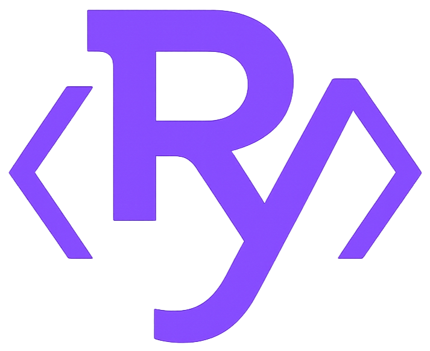

## RyunixJS 

 

### What is RyunixJS?

Like React, NextJS, Preact, Vite. Ryunix allows you to build static websites from JavaScript in a similar way to the aforementioned frameworks. However, Ryunix is planned to be completely standalone, i.e. without including React internally. This way allowing it to be more manageable and moldable for each developer. The reactivity of Ryunix is similar to Preact, however, it does not pretend to follow any standard of React or any similar Framework, but to allow to generate an SPA in its own way.

### Usage

`npx @unsetsoft/cra@latest`

## Do you want to contribute?

You can make any change as long as it does not affect the `noctura`, `canary`, `latest` branches. Make changes that are important, necessary or to add something new if you see it necessary, include your proposal before in an issue and then create a PR referencing that issue.

To be able to work more comfortably you should create a branch with this name `gh/[user]/[branch name]`, all changes should always go to the canary version. Once the changes are applied and no problems are detected, they will become part of the nightly version for further testing and finally the final version will be released. make each change with a simple descriptive message, and remember not to change the version of the mono repo or packages, such changes are made manually when a new update is about to be made.
