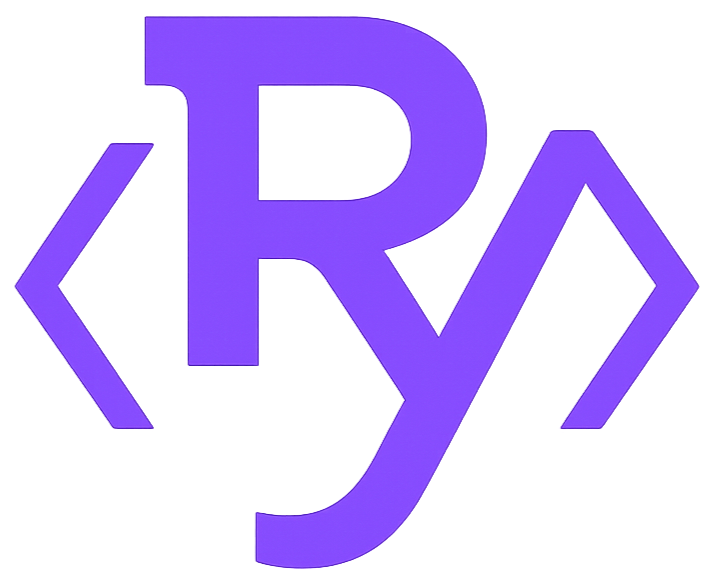

<!-- markdownlint-disable MD033 MD041 MD013 -->

> **Language / Idioma:** [English](./README.md) · [Español](./README.es.md)

<p align="center">
  
</p>

<h1 align="center">RyunixJS</h1>

<p align="center">
  <a href="https://www.npmjs.com/package/@unsetsoft/ryunixjs">
    
  </a>
  <a href="https://www.npmjs.com/package/@unsetsoft/ryunixjs/v/canary">
    
  </a>
  
  <a href="https://marketplace.visualstudio.com/items?itemName=unsetsoft.ryunixjs">
    
  </a>
  <a href="https://deepwiki.com/UnSetSoft/Ryunixjs"></a>
</p>

<p align="center">
  <strong>A powerful, standalone, and high-performance JavaScript framework for building modern web applications.</strong>
</p>

<!-- markdownlint-enable MD013 -->

---

## 🚀 What is RyunixJS?

RyunixJS is a modern UI framework designed to be **completely standalone**.
While it draws inspiration from popular libraries like React and Preact, it
doesn't include them internally. It provides a familiar API (Hooks, Components)
but follows its own path to allow for a more manageable and moldable development
experience.

Whether you're building a simple static site or a complex Single Page
Application (SPA) with Server-Side Rendering (SSR), RyunixJS gives you the tools
to do it efficiently.

## ✨ Key Features

- **🎯 Zero Dependencies**: The core library is lightweight and independent.
- **⚛️ Familiar API**: Use `useStore`, `useEffect`, `useContext`, and more.

  While similar to React, Ryunix provides its own specialized hooks.

- **🌐 Hybrid Rendering**: Built-in support for **SSR** (Server-Side Rendering)

  and **SSG** (Static Site Generation).

- **🔋 Server-Side Power**: Supports **Server Components** and \*\*Server

  Actions\*\* for modern full-stack workflows.

- **📝 Native MDX**: Write documentation or content-rich pages directly in MDX

  with seamless integration.

- **📦 Specialized Hooks**: Includes powerful built-ins like

  `usePersistentStore` (auto-sync with localStorage), `useSwitch` (toggle
  state), `useDebounce`, `useThrottle`, and more.

- **🛠️ Integrated Tooling**: Powerful presets and a dedicated CLI to get you

  started in seconds.

- **🔍 DevTools**: A dedicated browser extension to debug your Ryunix

  applications.

- **💻 VS Code Extension**: Syntax highlighting and editor support for `.ryx`

  files. [Install from the Marketplace](https://marketplace.visualstudio.com/items?itemName=unsetsoft.ryunixjs).

## 📦 Packages

RyunixJS is managed as a monorepo containing several specialized packages:

| Package                                                    | Description                                                            |
| :--------------------------------------------------------- | :--------------------------------------------------------------------- |
| [`@unsetsoft/ryunixjs`](./packages/core)                   | The core library containing the reconciler, hooks, and DOM utilities.  |
| [`@unsetsoft/ryunix-presets`](./packages/ryunix-presets)   | Unified tooling and Webpack configurations for different environments. |
| [`@unsetsoft/cra`](./packages/cra)                         | The Official CLI to scaffold new Ryunix projects effortlessly.         |
| [`@unsetsoft/ryunix-devtools`](./packages/ryunix-devtools) | Browser extension for debugging and inspecting component trees.        |
| [Ryunix VS Code Extension](https://marketplace.visualstudio.com/items?itemName=unsetsoft.ryunixjs) | Syntax highlighting and editor support for `.ryx` files.             |

## 🛠️ Getting Started

The quickest way to start a new project is using our CLI:

```bash
npx @unsetsoft/cra@latest my-ryunix-app
```

Navigate to your app and start the development server:

```bash
cd my-ryunix-app
npm run dev
```

Install the [VS Code extension](https://marketplace.visualstudio.com/items?itemName=unsetsoft.ryunixjs)
for `.ryx` syntax highlighting (optional; the CRA can add workspace recommendations with `--vscode`).

## 📚 Documentation

For maintainers and contributors exploring the monorepo:

- **[Internal technical overview](./docs/en/overview.md)** — architecture of

  `core`, `ryunix-presets`, and `cra` (Virtual DOM, hooks, CLI, routing, SSG,
  and more).

- **[Repository guide](./docs/en/guides/repository-guide.md)** — what RyunixJS
  is,

  comparison with Next.js, and root folder layout.

## 🤝 Contributing

We love contributions! If you have ideas, bug reports, or want to add a new
feature, please follow these steps:

1. **Check Issues**: See if there's already an existing issue or create a new

   one to propose your change.

2. **Branching Strategy**:
   - Create a branch named `gh/[user]/[feature-name]`.
   - All changes should target the `canary` branch first.
3. **Commit Messages**: Keep them simple and descriptive.
4. **Version Management**: Do **not** manually change package versions; this is

   handled during the release process.

Check out our [Contributing Guide](./CONTRIBUTING.md) for more details.

## 🔒 Security

If you discover a security vulnerability, do **not** open a public issue. See
our [Security Policy](./SECURITY.md) for supported versions and how to report
responsibly.

## 👑 Contributors

<a href="https://github.com/UnSetSoft/Ryunixjs/graphs/contributors">
  
</a>

## 📄 License

RyunixJS is [MIT Licensed](./LICENSE).

---

<p align="center">
  Built with ❤️ by <a href="https://github.com/UnSetSoft">UnSetSoft</a>
</p>
