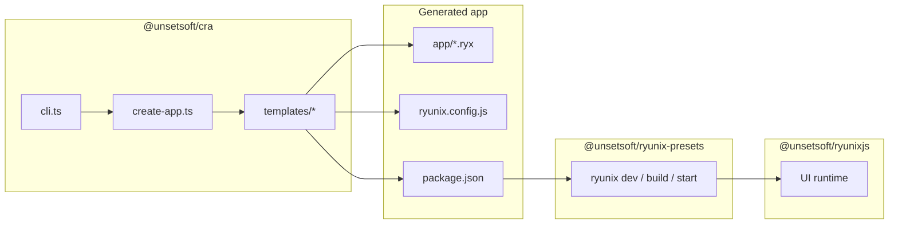

# Create Ryunix App — package overview

> **Language / Idioma:** [English](./package-overview.md) ·
> [Español](../../es/cra/resumen-del-paquete.md)

The npm package **`@unsetsoft/cra`** lives in `packages/cra/`. It is the
**official scaffolder** of the RyunixJS monorepo: it generates new project
folders from templates and wires the user to `@unsetsoft/ryunixjs` and
`@unsetsoft/ryunix-presets`. It does not ship the UI engine or Webpack.

---

## Table of contents

- [Create Ryunix App — package overview](#create-ryunix-app--package-overview)
  - [Table of contents](#table-of-contents)
  - [Role in the monorepo](#role-in-the-monorepo)
  - [Public usage](#public-usage)
  - [Layout of `packages/cra/`](#layout-of-packagescra)
  - [TypeScript and published artifacts](#typescript-and-published-artifacts)
  - [High-level flow](#high-level-flow)
  - [Related documentation](#related-documentation)

---

## Role in the monorepo

| Package                     | Responsibility                                      |
| :-------------------------- | :-------------------------------------------------- |
| `@unsetsoft/cra`            | Create the app skeleton (CLI + `templates/`)        |
| `@unsetsoft/ryunix-presets` | `ryunix dev`, `build`, `start`; Webpack and routing |
| `@unsetsoft/ryunixjs`       | Runtime: VDOM, hooks, reconciler, browser SSR       |

After running CRA, the developer works in a **generated app** with `app/*.ryx`,
`ryunix.config.js`, and scripts that call the preset’s `ryunix` binary. CRA is
not imported at runtime from the app.

---

## Public usage

```bash
npx @unsetsoft/cra@latest
npx @unsetsoft/cra@latest my-app --latest --tailwind
```

The binary points at `src/cli.js` (JavaScript emitted from `src/cli.ts`). See
[CLI and helpers](./cli-and-helpers.md) for flags and prompts.

---

## Layout of `packages/cra/`

```text
packages/cra/
├── package.json          # name: @unsetsoft/cra; bin → src/cli.js
├── tsconfig.json         # typecheck (--noEmit)
├── tsconfig.emit.json    # compiles .ts → .js under src/
├── README.md / README.es.md
├── src/
│   ├── cli.ts            # Entry: Commander + prompts
│   ├── create-app.ts     # Template copy, npm versions, patches
│   └── helpers/
│       ├── copy.ts           # Recursive copy (skips node_modules, dist, .ryunix)
│       ├── get-pkg-manager.ts  # npm | pnpm | yarn | bun (user-agent)
│       ├── is-folder-empty.ts  # Validates target directory
│       ├── git.ts              # Optional git init + initial commit
│       └── install.ts          # install helper (not used by create-app today)
└── templates/
    ├── ryunix-base/
    ├── ryunix-tailwind/
    ├── ryunix-eslint/
    └── ryunix-all/
```

What is **not** part of the framework runtime:

- `templates/` are sample projects in JS / `.ryx`; they are copied as-is to the
  user’s disk.
- `.js` files next to `.ts` under `src/` are **`tsc` output**, not hand-edited
  source (except after `pnpm run build`).

---

## TypeScript and published artifacts

| Aspect  | Detail                                                    |
| :------ | :-------------------------------------------------------- |
| Source  | `src/**/*.ts` only                                        |
| Check   | `pnpm --filter @unsetsoft/cra typecheck`                  |
| Emit    | `pnpm --filter @unsetsoft/cra build` → CommonJS in `src/` |
| Publish | `prepublishOnly` runs `build` before npm publish          |

CLI migration is **complete**. Templates remain JavaScript and `.ryx` because
they describe end-user apps, not the CRA package itself.

See [TypeScript in the monorepo](../guides/typescript-in-the-monorepo.md) for
workspace-wide details.

---

## High-level flow



1. The user runs `npx @unsetsoft/cra`.
2. `cli.ts` collects name, channel (`latest` / `canary`), compiler (`swc` /
   `babel`), Tailwind, ESLint, and VS Code options.
3. `create-app.ts` picks a template, copies files, and resolves
   `@unsetsoft/ryunixjs` and `@unsetsoft/ryunix-presets` versions from the npm
   registry.
4. The user runs `install` and `run dev`; the preset builds and serves the app.

---

## Related documentation

| Document                                                    | Content                                   |
| :---------------------------------------------------------- | :---------------------------------------- |
| [cli-and-helpers.md](./cli-and-helpers.md)                  | `cli.ts`, `create-app.ts`, helpers, flags |
| [template-generation.md](./template-generation.md)          | All four templates and app layout         |
| [Repository guide](../guides/repository-guide.md)           | Monorepo map                              |
| [Local integration app](../guides/local-integration-app.md) | Test CRA / presets with `test/`           |
| `packages/cra/README.md`                                    | CLI usage for publishers and end users    |
