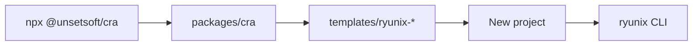

<!-- markdownlint-disable MD013 MD060 -->

# `packages/cra` — `@unsetsoft/cra`

Official **project scaffolder** for Ryunix (`npx @unsetsoft/cra`). Copies a
template, resolves npm versions (latest or canary), optionally adds Tailwind,
ESLint, VS Code workspace files, and initializes git. **Not** a runtime dependency
of existing apps.

**Read next:** [cli-and-helpers.md](./cli-and-helpers.md) and
[template-generation.md](./template-generation.md).

---

## Role in the monorepo

| Aspect        | Detail                                                                          |
| :------------ | :------------------------------------------------------------------------------ |
| **Consumers** | Developers creating new Ryunix projects                                         |
| **Output**    | App folder with `app/`, `ryunix.config.js`, `package.json`                      |
| **Injects**   | `@unsetsoft/ryunixjs`, `@unsetsoft/ryunix-presets` (+ optional Tailwind/ESLint) |
| **Publish**   | npm; included in root `pnpm publish:all`                                        |



---

## Package layout

```text
packages/cra/
├── src/
│   ├── cli.js              # Commander entry (package bin)
│   └── create-app.js       # Prompts, copy, versions, .vscode, git
├── helpers/                # copy, git, pkg manager, favicon, …
├── templates/
│   ├── ryunix-base/
│   ├── ryunix-tailwind/
│   ├── ryunix-eslint/
│   └── ryunix-all/
└── package.json
```

### Template selection

| Condition                 | Template          |
| :------------------------ | :---------------- |
| `--tailwind` + `--eslint` | `ryunix-all`      |
| `--tailwind` only         | `ryunix-tailwind` |
| `--eslint` only           | `ryunix-eslint`   |
| neither                   | `ryunix-base`     |

Flags `--no-tailwind`, `--no-eslint`, `--no-vscode` skip interactive prompts.

### Typical generated tree

```text
app/index.ryx, layout.ryx, errors.ryx
app/api/hello/router.js
styles/global.css
ryunix.config.js
package.json
```

Templates ship `gitignore` (no leading dot) for npm publish; CRA renames to
`.gitignore`. `public/favicon.png` is created if missing.

---

## `create-app.js` flow

1. Resolve destination; ensure empty folder.
2. Pick template from flags/prompts.
3. Recursive copy (skips `node_modules`, `dist`, `.ryx` in source template).
4. Patch `package.json` name and privacy.
5. Query registry for `@unsetsoft/ryunixjs` and `@unsetsoft/ryunix-presets` versions.
6. Add Tailwind/ESLint deps when requested.
7. Inject `compiler: 'swc'|'babel'` into `ryunix.config.js`.
8. If `--vscode`: write `.vscode/extensions.json` + `settings.json`.
9. `git init` + initial commit.
10. Print instructions — user runs `pnpm install` and `pnpm run dev` (**install is not run automatically**).

---

## CLI flags

| Flag                                   | Effect                             |
| :------------------------------------- | :--------------------------------- |
| `[directory]`                          | Project path/name                  |
| `--latest` / `--canary`                | Ryunix package channel             |
| `--tailwind` / `--eslint` / `--vscode` | Skip prompts; enable feature       |
| `--compiler swc\|babel`                | Written to `ryunix.config.js`      |
| `--no-*`                               | Disable optional features via argv |

### `--vscode` workspace

Recommends `unsetsoft.ryunixjs` and `dbaeumer.vscode-eslint`; with `--eslint`, also
Prettier and `*.ryx` formatting. See
[../ryunix-vscode/package-overview.md](../ryunix-vscode/package-overview.md).

---

## Commands

```bash
pnpm --filter @unsetsoft/cra run dev
npx @unsetsoft/cra@latest my-app --canary --tailwind --eslint --vscode
```

Maintainers: `pnpm run cra:release` or `pnpm run cra:nightly` at repo root.

---

## Related packages

| Package                   | Relationship                               |
| :------------------------ | :----------------------------------------- |
| `core` / `ryunix-presets` | Versions added to generated `package.json` |
| `ryunix-vscode`           | Recommended via `--vscode`                 |
| `ryunix-devtools`         | Not installed by CRA                       |

---

## Docs in `docs/en/cra/`

| Document                                           | Topic                 |
| :------------------------------------------------- | :-------------------- |
| [cli-and-helpers.md](./cli-and-helpers.md)         | CLI and helpers       |
| [template-generation.md](./template-generation.md) | Maintaining templates |

Spanish: [docs/es/cra/resumen-paquete.md](../../es/cra/resumen-paquete.md).
