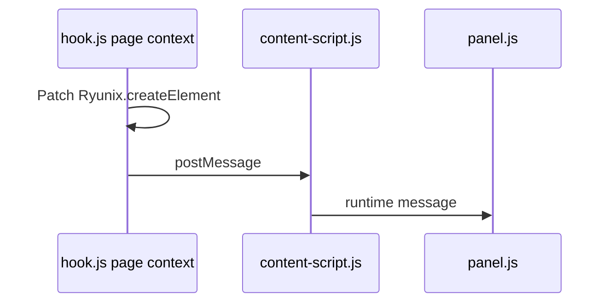

<!-- markdownlint-disable MD013 MD060 -->

# `packages/ryunix-devtools` — Chrome extension

**Manifest V3** Chromium extension to inspect running Ryunix apps: component
list, sanitized props, and render timing in a custom DevTools panel. Complements
core dev utilities (`devtools.js`, `profiler.js`) but does not replace them.

**Not an npm dependency** of apps. Load unpacked or distribute a zip build.

---

## Role in the monorepo

| Aspect               | Detail                                               |
| :------------------- | :--------------------------------------------------- |
| **Consumers**        | Developers debugging in the browser                  |
| **Page requirement** | `window.Ryunix` from the client bundle               |
| **Publish**          | Excluded from `pnpm publish:all`                     |
| **Core integration** | External monkey-patch; no official reconciler bridge |



---

## Package layout

```text
packages/ryunix-devtools/
├── manifest.json
├── background.js           # Service worker
├── content-script.js       # Bridge; injects hook.js
├── hook.js                 # Patches window.Ryunix
├── devtools.html / devtools.js
├── panel.html / panel.js   # Components + Performance tabs
└── README.md
```

| File                  | Role                                                            |
| :-------------------- | :-------------------------------------------------------------- |
| **hook.js**           | Waits for `Ryunix`, sends fiber/render events via `postMessage` |
| **content-script.js** | Forwards page messages to the extension                         |
| **panel.js**          | DevTools UI                                                     |

### vs `packages/core`

| Core module                   | Used by extension? |
| :---------------------------- | :----------------- |
| `window.Ryunix` (`main.js`)   | **Yes**            |
| `devtools.js` (hook warnings) | **No**             |
| `profiler.js`                 | **No**             |

The extension does not read reconciler fibers; it infers data from patched
`createElement`. Treat it as an inspection prototype, not a stable runtime API.

---

## Usage

1. Chrome → `chrome://extensions/` → Developer mode → **Load unpacked** →
   `packages/ryunix-devtools`.
2. Run a Ryunix app (`pnpm run dev`).
3. Open DevTools → **Ryunix** panel.

Optional: `npm run build` in the package for a zip (see package README).

---

## Known limitations

| Topic       | Detail                                               |
| :---------- | :--------------------------------------------------- |
| Panel icons | Referenced paths may be missing in the tree          |
| Data model  | Flat fiber list, not full reconciler tree            |
| Highlight   | Page overlay from hook; not wired to panel selection |
| Stability   | Depends on `Ryunix.createElement` shape              |

Future work could add official hooks in core; see
[../core/devtools-and-profiler.md](../core/devtools-and-profiler.md).

---

## Related packages

| Package          | Relationship                                    |
| :--------------- | :---------------------------------------------- |
| `core`           | Provides `window.Ryunix`                        |
| `ryunix-presets` | Serves the app under debug                      |
| `ryunix-vscode`  | Editor support; separate from browser debugging |
| `cra`            | Does not install the extension                  |

Spanish: [docs/es/ryunix-devtools/resumen-paquete.md](../../es/ryunix-devtools/resumen-paquete.md).
