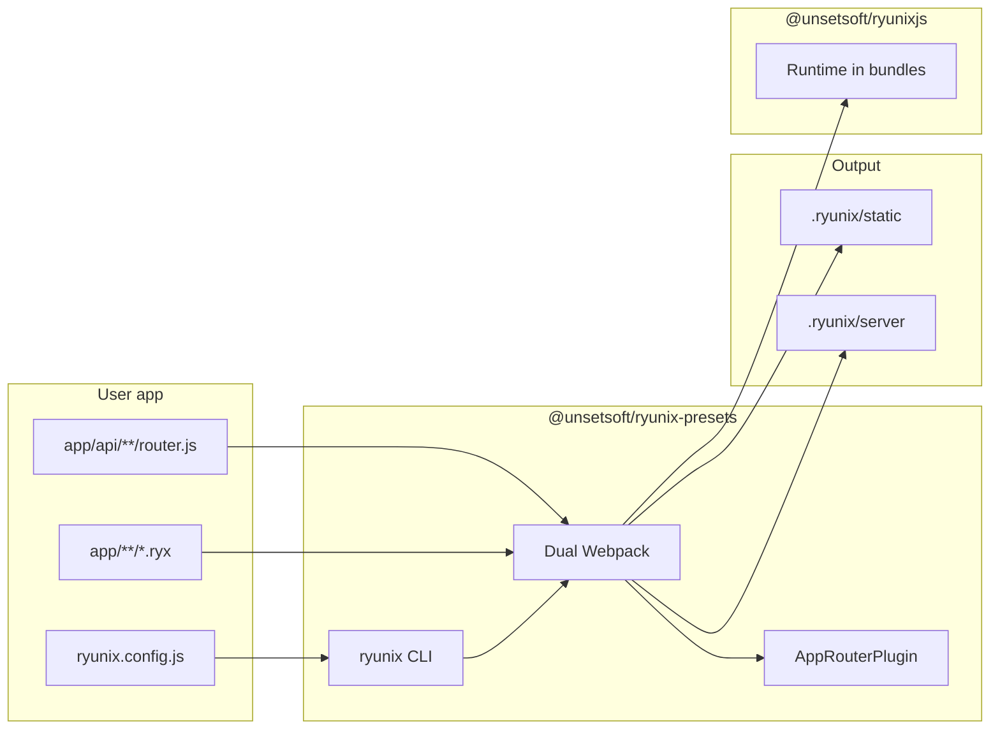

# Ryunix Presets — package overview

> **Language / Idioma:** [English](./package-overview.md) ·
> [Español](../../es/ryunix-presets/resumen-paquete.md)

The npm package **`@unsetsoft/ryunix-presets`** lives in
`packages/ryunix-presets/`. It is RyunixJS **build tooling and CLI**: the
`ryunix` command, dual Webpack (client + server), file-based routing under
`app/`, SSG, API routes, and loaders (RSC, Server Actions, MDX). It lists core
as a `peerDependency`.

---

## Table of contents

- [Ryunix Presets — package overview](#ryunix-presets--package-overview)
  - [Table of contents](#table-of-contents)
  - [Role in the monorepo](#role-in-the-monorepo)
  - [Public usage](#public-usage)
  - [Layout of `packages/ryunix-presets/`](#layout-of-packagesryunix-presets)
  - [CLI commands (`ryunix`)](#cli-commands-ryunix)
  - [TypeScript and published artifacts](#typescript-and-published-artifacts)
  - [High-level flow](#high-level-flow)
  - [Related documentation](#related-documentation)

---

## Role in the monorepo

| Package                     | Responsibility                                        |
| :-------------------------- | :---------------------------------------------------- |
| `@unsetsoft/ryunix-presets` | Dev server, build, start, Webpack, `ryunix.config.js` |
| `@unsetsoft/ryunixjs`       | Runtime imported in bundles the preset produces       |
| `@unsetsoft/cra`            | Adds the preset to new apps’ `devDependencies`        |

**Compile-time routing**, **SSG**, and the **dev server** live here—not in
`packages/core`, except for APIs core exports for SSR and Server Actions.

---

## Public usage

In the app `package.json`:

```json
{
  "scripts": {
    "dev": "ryunix dev",
    "build": "ryunix build",
    "start": "ryunix start"
  },
  "devDependencies": {
    "@unsetsoft/ryunix-presets": "^1.0.x"
  }
}
```

Root config:

```javascript
/** @type {import('@unsetsoft/ryunix-presets').RyunixUserConfig} */
const RyunixSettings = { compiler: 'swc' }
export default RyunixSettings
```

Published types: `webpack/config.d.ts` (`RyunixUserConfig`).

---

## Layout of `packages/ryunix-presets/`

```text
packages/ryunix-presets/
├── package.json              # bin: ryunix → webpack/bin/index.js
├── tsconfig.json             # typecheck
├── tsconfig.emit.json        # compiles webpack/**/*.ts → .js next to sources
└── webpack/
    ├── bin/
    │   ├── index.ts          # yargs CLI: dev, build, start, lint, customHtml
    │   ├── dev.server.ts     # Development server
    │   ├── prod.server.ts    # Production server
    │   ├── compiler.ts       # Runs Webpack
    │   └── prerender.ts      # SSG after build
    ├── utils/
    │   ├── config.cjs        # Defaults and ryunix.config loading
    │   ├── appRouterPlugin.ts
    │   ├── ApiRouterPlugin.ts
    │   ├── ssg.ts / ssgPlugin.ts
    │   └── apiHandler.ts, ssrDevHandler.ts, …
    ├── loaders/
    │   ├── ryunix-rsc-loader.ts
    │   └── ryunix-server-action-loader.ts
    ├── plugins/
    │   └── remark-github-alerts.ts
    ├── webpack.config.ts     # Dual client/server config
    ├── eslint.config.ts      # Opinionated ESLint for `ryunix lint`
    ├── config.d.ts           # Consumer types
    ├── index.ts              # Package export (types / utilities)
    └── template/
        └── index.html        # Base HTML template
```

npm publishes the **`webpack/`** folder only. `.js` next to `.ts` under
`webpack/` includes `tsc` output and legacy sources; run `build` after editing
`.ts` before testing the CLI locally.

---

## CLI commands (`ryunix`)

| Command             | Summary                                                    |
| :------------------ | :--------------------------------------------------------- |
| `ryunix dev`        | Development mode, HMR, SSR handler                         |
| `ryunix build`      | Cleans `.ryunix/`, Webpack compile, optional SSG prerender |
| `ryunix start`      | Serves production build (`build/static`)                   |
| `ryunix lint`       | ESLint with preset config                                  |
| `ryunix customHtml` | Copies base `index.html` into `public/`                    |

Details: [cli-and-bootstrapping.md](./cli-and-bootstrapping.md).

---

## TypeScript and published artifacts

| Aspect            | Detail                                                           |
| :---------------- | :--------------------------------------------------------------- |
| Maintainer source | `webpack/**/*.ts` (entry/utils migration per module)             |
| Check             | `pnpm --filter @unsetsoft/ryunix-presets typecheck`              |
| Emit              | `pnpm --filter @unsetsoft/ryunix-presets build`                  |
| Consumer          | Uses published `.d.ts` + `.js` only; does not compile the preset |

Some files remain `.cjs` (`config.cjs`, `settingfile.cjs`) for Node config
loading.

See [TypeScript in the monorepo](../guides/typescript-in-the-monorepo.md).

---

## High-level flow



1. `ryunix dev` loads config, discovers routes under `app/`, starts Webpack +
   server.
2. `ryunix build` produces static and server artifacts for production/SSG.
3. The browser loads chunks that import `@unsetsoft/ryunixjs`.

---

## Related documentation

| Document                                                | Content                       |
| :------------------------------------------------------ | :---------------------------- |
| [cli-and-bootstrapping.md](./cli-and-bootstrapping.md)  | Dev/prod servers, commands    |
| [configuration-loading.md](./configuration-loading.md)  | `ryunix.config.js`            |
| [routing-and-ssg.md](./routing-and-ssg.md)              | Router and prerender          |
| [api-router.md](./api-router.md)                        | API routes                    |
| [webpack-loaders.md](./webpack-loaders.md)              | RSC and Server Actions        |
| [core/package-overview.md](../core/package-overview.md) | Engine bundled by the preset  |
| `packages/ryunix-presets/README.md`                     | User-facing install and flags |
