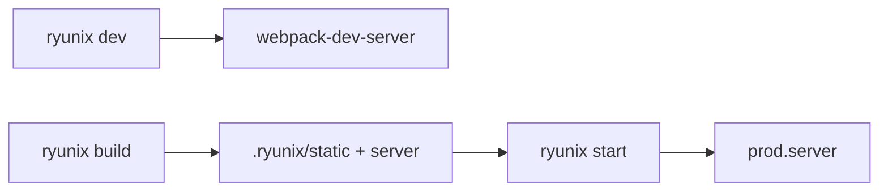

<!-- markdownlint-disable MD013 MD060 -->

# `packages/ryunix-presets` — `@unsetsoft/ryunix-presets`

**Build tooling and CLI** for Ryunix applications: the `ryunix` command, dual
Webpack compilers (client + server), file-based App Router, SSG, API routes, and
loaders for server/client boundaries and Server Actions. Apps use this package
only as a **devDependency** — not in the browser runtime bundle as a library.

**Read next:** [cli-and-startup.md](./cli-and-startup.md) and
[routing-and-ssg.md](./routing-and-ssg.md).

---

## Role in the monorepo

| Aspect           | Detail                                                   |
| :--------------- | :------------------------------------------------------- |
| **Consumers**    | CRA-generated apps, templates, `test/webpack`            |
| **Peer**         | `@unsetsoft/ryunixjs`                                    |
| **Distribution** | Source under `webpack/` (no separate preset build in CI) |
| **Binary**       | `ryunix` → `webpack/bin/index.mjs`                       |



---

## Package layout

```text
packages/ryunix-presets/
├── package.json
└── webpack/
    ├── bin/                    # CLI + dev/prod servers + prerender
    ├── utils/                  # Ryunix plugins (AppRouter, API, SSG, SSR dev, …)
    ├── loaders/                # RSC + server-action loaders
    ├── webpack.config.mjs
    ├── eslint.config.mjs
    └── index.js
```

### Ryunix plugins (`utils/`)

| Module                 | Role                                                               |
| :--------------------- | :----------------------------------------------------------------- |
| **AppRouterPlugin**    | Scans `app/`, generates `.ryunix/server/app/*`, SSG route manifest |
| **ApiRouterPlugin**    | Compiles `app/api/**` to `.ryunix/server/api/**`                   |
| **RyunixRoutesPlugin** | Legacy SSG from `pages/routes.ryx`                                 |
| **ssrDevHandler**      | SSR HTML in development                                            |
| **apiHandler**         | Serves `/api/*` in dev and prod                                    |

### Loaders

| Loader                          | Role                                                 |
| :------------------------------ | :--------------------------------------------------- |
| **ryunix-rsc-loader**           | Strips `// @server` / `// @client` by compile target |
| **ryunix-server-action-loader** | Server registration + client `createActionProxy`     |

### CLI

| Command      | Summary                                     |
| :----------- | :------------------------------------------ |
| `dev`        | Webpack dev server, HMR, SSR/API middleware |
| `build`      | Production compile + optional SSG prerender |
| `start`      | Static server (requires prior build)        |
| `lint`       | ESLint on `**/*.ryx`                        |
| `customHtml` | Legacy HTML template copy                   |

---

## App conventions

### `app/` (App Router)

| File                        | Role                                                            |
| :-------------------------- | :-------------------------------------------------------------- |
| `index.ryx`                 | Route page                                                      |
| `layout.ryx`                | Nested layout                                                   |
| `loading.ryx`               | Suspense fallback                                               |
| `error.ryx`                 | Route error UI (plugin looks for `error.ryx`, not `errors.ryx`) |
| `// @server` / `// @client` | Boundary directives                                             |

**Server vs client:** `export async default` → server; hooks → client.

**Metadata:** `Metatags`, `frontmatter`, `generateMetadata`.

**API:** `app/api/<name>/router.js` → `/api/<name>`.

### Build output (default `.ryunix/`)

| Path                  | Contents            |
| :-------------------- | :------------------ |
| `.ryunix/static/`     | Client assets       |
| `.ryunix/server/app/` | Generated routers   |
| `.ryunix/server/api/` | API handlers        |
| `.ryunix/cache/`      | Webpack + SSG cache |

Do not hand-edit generated `app-router.js` / `main.ryx`.

Config: [config-loading.md](./config-loading.md).

---

## Commands

In an app directory:

```bash
pnpm run dev
pnpm run build
pnpm run start
```

Monorepo lint:

```bash
pnpm --filter @unsetsoft/ryunix-presets exec eslint webpack --max-warnings=0 --config ../../eslint.config.mjs
```

---

## Related packages

| Package         | Relationship                        |
| :-------------- | :---------------------------------- |
| `core`          | Runtime bundled or externalized     |
| `cra`           | Installs preset and scripts         |
| `ryunix-vscode` | ESLint language `ryunix` for `.ryx` |

---

## Docs in `docs/en/ryunix-presets/`

| Document                                   | Topic              |
| :----------------------------------------- | :----------------- |
| [cli-and-startup.md](./cli-and-startup.md) | Dev/prod servers   |
| [config-loading.md](./config-loading.md)   | `ryunix.config.js` |
| [routing-and-ssg.md](./routing-and-ssg.md) | App Router and SSG |
| [api-router.md](./api-router.md)           | API routes         |
| [webpack-loaders.md](./webpack-loaders.md) | RSC and actions    |

Spanish: [docs/es/ryunix-presets/resumen-paquete.md](../../es/ryunix-presets/resumen-paquete.md).
