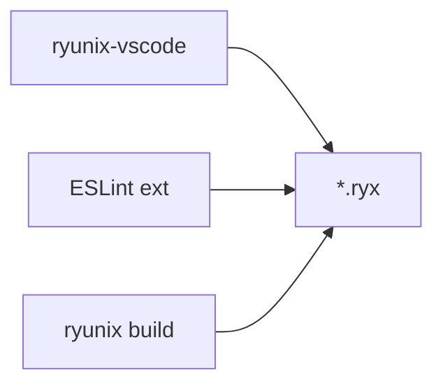

<!-- markdownlint-disable MD013 MD060 -->

# `packages/ryunix-vscode` — VS Code extension

Source for the **RyunixJS** editor extension on Visual Studio Marketplace:
[`unsetsoft.ryunixjs`](https://marketplace.visualstudio.com/items?itemName=unsetsoft.ryunixjs).
Syntax highlighting, snippets, and lightweight completions for `.ryx` files
(JS + JSX with App Router conventions). Does **not** replace the compiler or
TypeScript LSP.

---

## Role in the monorepo

| Aspect | Detail |
| :----- | :----- |
| **Consumers** | Developers editing `.ryx` in VS Code |
| **App runtime** | Apps use `@unsetsoft/ryunixjs`; this package is editor-only |
| **CRA** | `--vscode` recommends Ryunix + ESLint (+ Prettier with `--eslint`) |
| **Publish** | Marketplace / `.vsix`; excluded from npm `publish:all` |



---

## Package layout

```text
packages/ryunix-vscode/
├── src/                    # TypeScript source
│   ├── extension.ts
│   └── completion/         # provider, imports, keywords, file-context
├── out/                    # Compiled entry (package.json main)
├── language/               # ryunix + ryx-tags configuration
├── syntaxes/               # TextMate grammar (~6k lines)
├── snippets/
├── assets/                 # icon + logos
├── test/                   # grammar regression
├── .vscode/                # F5 + compile task
├── package.json            # name "ryunixjs" → unsetsoft.ryunixjs
└── ROADMAP.md
```

Marketplace ID is `{publisher}.{name}` → `unsetsoft.ryunixjs` (name is intentional).

---

## How it works

| Layer | Implementation |
| :---- | :--------------- |
| **Syntax** | `source.js.ryx` grammar + embedded `ryx-tags` |
| **Snippets** | `javascript.code-snippets` |
| **Completions** | `src/completion/provider.ts` — core exports, keywords, file-name templates |
| **Go to definition** | Ctrl+click on `@unsetsoft/ryunixjs` exports → `node_modules` or monorepo `packages/core` |
| **Hover** | Tooltips for Ryunix exports, HTML tags, `className` tokens |
| **Tailwind** | Defaults for Tailwind CSS IntelliSense; CRA `--tailwind` recommends that extension |

In TS/JS this comes from a **Language Server**. For `.ryx` the extension provides a
subset without full LSP (no local cross-file symbol navigation yet).

Contextual suggestions for `layout.ryx`, `index.ryx`, etc. `frontmatter` is
documented as an alias for `Metatags`.

---

## Scope

| Supported | Not supported |
| :-------- | :------------ |
| `.ryx` highlighting, snippets, completions | MDX (build-time loader) |
| ESLint workspace integration (CRA) | TypeScript inside `.ryx` |
| Emmet for `ryunix` | Bundled formatter (use Prettier in project) |
| Grammar regression tests | LSP — see `ROADMAP.md` |

CRA API templates use `router.js`; `.ryx` API snippets are optional.

---

## Commands

```bash
pnpm --filter ./packages/ryunix-vscode run compile
pnpm --filter ./packages/ryunix-vscode run watch
pnpm --filter ./packages/ryunix-vscode run test
pnpm --filter ./packages/ryunix-vscode run build
code --install-extension packages/ryunix-vscode/ryunixjs-1.0.4.vsix
```

**F5:** open `packages/ryunix-vscode`, run **Extension** (compiles via `preLaunchTask`).

---

## Related packages

| Package | Relationship |
| :------ | :------------- |
| `core` | Completion export list |
| `cra` | `--vscode` workspace files |
| `ryunix-presets` | ESLint `ryunix`; `app/` conventions |
| `ryunix-devtools` | Browser debugging (separate) |

---

## Related docs

| Topic | Document |
| :---- | :------- |
| CRA `--vscode` | [../cra/cli-and-helpers.md](../cra/cli-and-helpers.md) |
| App Router files | [../ryunix-presets/routing-and-ssg.md](../ryunix-presets/routing-and-ssg.md) |

Spanish: [docs/es/ryunix-vscode/resumen-paquete.md](../../es/ryunix-vscode/resumen-paquete.md).

Package README: `packages/ryunix-vscode/README.md`.
