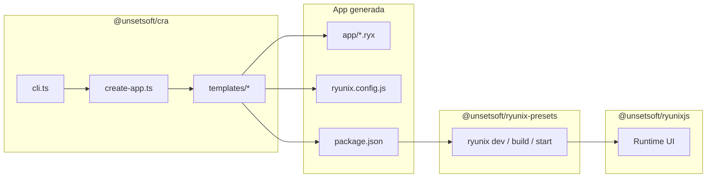

# Create Ryunix App — resumen del paquete

> **Language / Idioma:** [English](../../en/cra/package-overview.md) ·
> [Español](./resumen-del-paquete.md)

El paquete npm **`@unsetsoft/cra`** vive en `packages/cra/`. Es el **scaffolder
oficial** del monorepo RyunixJS: genera carpetas de proyecto nuevas a partir de
plantillas y conecta al usuario con `@unsetsoft/ryunixjs` y
`@unsetsoft/ryunix-presets`. No incluye el motor de UI ni Webpack.

---

## Índice

- [Create Ryunix App — resumen del paquete](#create-ryunix-app--resumen-del-paquete)
  - [Índice](#índice)
  - [Rol en el monorepo](#rol-en-el-monorepo)
  - [Uso público](#uso-público)
  - [Estructura de `packages/cra/`](#estructura-de-packagescra)
  - [TypeScript y artefactos publicados](#typescript-y-artefactos-publicados)
  - [Flujo de alto nivel](#flujo-de-alto-nivel)
  - [Documentación relacionada](#documentación-relacionada)

---

## Rol en el monorepo

| Paquete                     | Responsabilidad                                       |
| :-------------------------- | :---------------------------------------------------- |
| `@unsetsoft/cra`            | Crear el esqueleto de la app (CLI + `templates/`)     |
| `@unsetsoft/ryunix-presets` | `ryunix dev`, `build`, `start`; Webpack y routing     |
| `@unsetsoft/ryunixjs`       | Runtime: VDOM, hooks, reconciler, SSR en el navegador |

Tras ejecutar CRA, el desarrollador trabaja en una **app generada** con
`app/*.ryx`, `ryunix.config.js` y scripts que invocan el binario `ryunix` del
preset. CRA no se importa desde la app en tiempo de ejecución.

---

## Uso público

```bash
npx @unsetsoft/cra@latest
npx @unsetsoft/cra@latest mi-app --latest --tailwind
```

El binario apunta a `src/cli.js` (JavaScript emitido desde `src/cli.ts`). Ver
[CLI y ayudantes](./cli-y-ayudantes.md) para flags y prompts.

---

## Estructura de `packages/cra/`

```text
packages/cra/
├── package.json          # name: @unsetsoft/cra; bin → src/cli.js
├── tsconfig.json         # typecheck (--noEmit)
├── tsconfig.emit.json    # compila .ts → .js en src/
├── README.md / README.es.md
├── src/
│   ├── cli.ts            # Entrada: Commander + prompts
│   ├── create-app.ts     # Copia plantilla, versiones npm, parches
│   └── helpers/
│       ├── copy.ts           # Copia recursiva (omite node_modules, dist, .ryunix)
│       ├── get-pkg-manager.ts  # npm | pnpm | yarn | bun (user-agent)
│       ├── is-folder-empty.ts  # Valida carpeta destino
│       ├── git.ts              # git init + commit inicial opcional
│       └── install.ts          # Helper para install (no usado en create-app hoy)
└── templates/
    ├── ryunix-base/
    ├── ryunix-tailwind/
    ├── ryunix-eslint/
    └── ryunix-all/
```

Lo que **no** forma parte del runtime del framework:

- `templates/` son proyectos de ejemplo en JS / `.ryx`; se copian tal cual al
  disco del usuario.
- Los `.js` junto a los `.ts` en `src/` son **salida de `tsc`**, no fuente
  manual (salvo tras `pnpm run build`).

---

## TypeScript y artefactos publicados

| Aspecto      | Detalle                                                   |
| :----------- | :-------------------------------------------------------- |
| Fuente       | Solo `src/**/*.ts`                                        |
| Comprobación | `pnpm --filter @unsetsoft/cra typecheck`                  |
| Emit         | `pnpm --filter @unsetsoft/cra build` → CommonJS en `src/` |
| Publish      | `prepublishOnly` ejecuta `build` antes de subir a npm     |

Fase de migración **completada** para el código del CLI. Las plantillas siguen
en JavaScript y `.ryx` porque describen apps de usuario, no el paquete CRA.

Más detalle en [TypeScript en el monorepo](../guias/typescript-en-el-monorepo.md).

---

## Flujo de alto nivel



1. El usuario ejecuta `npx @unsetsoft/cra`.
2. `cli.ts` recoge nombre, canal (`latest` / `canary`), compilador (`swc` /
   `babel`), Tailwind, ESLint y VS Code.
3. `create-app.ts` elige una plantilla, copia archivos y resuelve versiones de
   `@unsetsoft/ryunixjs` y `@unsetsoft/ryunix-presets` contra el registro npm.
4. El usuario hace `install` y `run dev`; el preset compila y sirve la app.

---

## Documentación relacionada

| Documento                                                        | Contenido                                      |
| :--------------------------------------------------------------- | :--------------------------------------------- |
| [cli-y-ayudantes.md](./cli-y-ayudantes.md)                       | `cli.ts`, `create-app.ts`, helpers, flags      |
| [generacion-de-plantillas.md](./generacion-de-plantillas.md)     | Las cuatro plantillas y layout de app          |
| [Guía del repositorio](../guias/guia-del-repositorio.md)         | Mapa del monorepo                              |
| [App de integración local](../guias/app-de-integracion-local.md) | Probar CRA / presets con `test/`               |
| `packages/cra/README.md`                                         | Uso orientado a quien publica o ejecuta el CLI |
