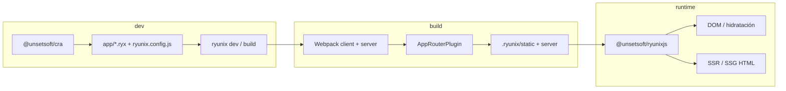

# Guía del repositorio RyunixJS

> **Language / Idioma:** [English](../../en/guides/repository-guide.md) ·
> [Español](./guia-del-repositorio.md)

Documento orientado a desarrolladores que clonan el monorepo por primera vez.
Resume qué es el proyecto, cómo funciona, en qué se parece a Next.js y qué
significa cada elemento de la raíz (`/`).

---

## Índice

- [Guía del repositorio RyunixJS](#guía-del-repositorio-ryunixjs)
  - [Índice](#índice)
  - [¿Qué es RyunixJS?](#qué-es-ryunixjs)
  - [Paquetes del monorepo](#paquetes-del-monorepo)
  - [¿Cómo funciona?](#cómo-funciona)
  - [¿Es como Next.js?](#es-como-nextjs)
  - [Archivos y carpetas de la raíz (`/`)](#archivos-y-carpetas-de-la-raíz-)
  - [Desarrollo local: el equivalente a `pnpm dev`](#desarrollo-local-el-equivalente-a-pnpm-dev)
  - [Comandos útiles (desde la raíz)](#comandos-útiles-desde-la-raíz)
  - [Documentación relacionada](#documentación-relacionada)
  - [Resumen en una frase](#resumen-en-una-frase)

---

## ¿Qué es RyunixJS?

**RyunixJS** es un framework de UI en JavaScript **completamente
independiente**: no embebe React ni Preact. Ofrece una API familiar
(componentes, JSX, hooks) pero con un motor propio: reconciliador basado en
fibers, render concurrente, SSR/SSG, Server Components y Server Actions.

Está mantenido por [UnSetSoft](https://github.com/UnSetSoft) y se publica en npm
bajo el scope `@unsetsoft/*`.

### Características principales

- **Cero dependencias en el core**: librería ligera e independiente.
- **API tipo React**: `useStore`, `useEffect`, `useContext`, etc. (con nombres y

  comportamientos propios de Ryunix).

- **Render híbrido**: CSR, SSR y SSG integrados.
- **Full-stack**: Server Components, Server Actions, rutas API.
- **MDX nativo**: contenido enriquecido en páginas.
- **Tooling integrado**: CLI, presets Webpack, servidor de producción.
- **DevTools**: extensión de navegador para inspeccionar componentes.

---

## Paquetes del monorepo

| Paquete                      | Ruta                       | Descripción                                                                  |
| :--------------------------- | :------------------------- | :--------------------------------------------------------------------------- |
| `@unsetsoft/ryunixjs`        | `packages/core`            | Motor: VDOM, reconciliación, hooks, render e hidratación.                    |
| `@unsetsoft/ryunix-presets`  | `packages/ryunix-presets`  | CLI `ryunix`, configuración Webpack (cliente + servidor), routing, SSG, API. |
| `@unsetsoft/cra`             | `packages/cra`             | Scaffolding: `npx @unsetsoft/cra@latest mi-app`.                             |
| `@unsetsoft/ryunix-devtools` | `packages/ryunix-devtools` | Extensión de navegador para depuración.                                      |

---

## ¿Cómo funciona?

### 1. El core: de JSX al DOM

1. El JSX se transpila a llamadas a `createElement`.
2. Se construye un árbol virtual (fibers).
3. Un **work loop** procesa fibers en trozos (prioridad alta con microtasks,

   baja con `requestIdleCallback`) para no bloquear el hilo principal.

4. El **reconciler** compara hijos viejos y nuevos (por `key`) y marca efectos:

   crear, actualizar, borrar o hidratar.

5. La fase **commit** aplica cambios al DOM de forma síncrona y ejecuta efectos

   (`useLayoutEffect`, `useEffect`).

Documentación técnica detallada:
[Virtual DOM y reconciliación](./core/vdom-y-reconciliacion.md).

### 2. Los presets: compilación y servidor

Al ejecutar `npm run dev` en una app generada, entra el CLI **`ryunix`**:

| Comando        | Función                                                       |
| :------------- | :------------------------------------------------------------ |
| `ryunix dev`   | Webpack dual (cliente + servidor), HMR, SSR en desarrollo.    |
| `ryunix build` | Limpia artefactos, compila y puede prerenderizar rutas (SSG). |
| `ryunix start` | Servidor HTTP de producción (caché, compresión, APIs).        |

El **routing es basado en archivos** bajo `app/`:

- Páginas: `app/index.ryx`, `app/about/index.ryx`, etc.
- Layouts: `app/layout.ryx`
- Errores: `app/errors.ryx`
- APIs: `app/api/.../router.js`

Un plugin de Webpack escanea `app/`, infiere componentes de servidor o cliente y
genera el router con `Suspense`, `ServerBoundary` y `ErrorBoundary`.

Más información: [CLI y arranque](./ryunix-presets/cli-y-arranque.md),
[Enrutamiento y SSG](./ryunix-presets/enrutamiento-y-ssg.md).

### 3. Flujo de una aplicación



### 4. Uso rápido (app nueva, fuera de este repo)

```bash
npx @unsetsoft/cra@latest my-ryunix-app
cd my-ryunix-app
npm run dev
```

Ejemplo de página (`app/index.ryx`):

```jsx
export const Metatags = {
  title: 'Ryunix App',
  description: 'Mi aplicación Ryunix',
}

export default function Index() {
  return (
    <main>
      <h1>Welcome to Ryunix</h1>
    </main>
  )
}
```

---

## ¿Es como Next.js?

### Sí en intención y arquitectura; no en implementación

### Similitudes

| Concepto             | Next.js                      | RyunixJS                                |
| :------------------- | :--------------------------- | :-------------------------------------- |
| Routing por carpetas | `app/page.tsx`, `layout.tsx` | `app/index.ryx`, `layout.ryx`           |
| Render híbrido       | CSR, SSR, SSG                | CSR, SSR, SSG                           |
| Full-stack           | API routes, Server Actions   | `app/api/.../router.js`, Server Actions |
| Tooling              | `next dev`, `build`, `start` | `ryunix dev`, `build`, `start`          |

### Diferencias importantes

1. **Motor distinto**: Next usa **React**. Ryunix tiene reconciliador y hooks

   **propios** (`useStore`, no `useState` de React).

2. **No es un metaframework sobre React**: es standalone; la API _recuerda_ a

   React, pero el runtime es otro.

3. **Stack de build**: Ryunix usa **Webpack + `@unsetsoft/ryunix-presets`** de

   forma muy integrada.

4. **Ecosistema**: Next tiene adopción masiva; Ryunix es más pequeño y en

   evolución.

5. **Convenciones**: archivos `.ryx`, `ryunix.config.js`, plugins que generan el

   router en compile time.

### Analogía

```text
React  → motor de UI          →  @unsetsoft/ryunixjs (packages/core)
Next   → React + full-stack   →  ryunix-presets + CRA + app/
```

---

## Archivos y carpetas de la raíz (`/`)

La raíz es el **monorepo del framework**, no una aplicación Ryunix. No
encontrarás `app/index.ryx` aquí; eso vive en proyectos creados con CRA.

### Carpetas principales

| Carpeta     | Qué contiene                                                           |
| :---------- | :--------------------------------------------------------------------- |
| `packages/` | Código publicable: `core`, `ryunix-presets`, `cra`, `ryunix-devtools`. |
| `docs/`     | Documentación interna (arquitectura, presets, CRA). Incluye esta guía. |
| `assets/`   | Recursos del repo (p. ej. `logo.png` del README).                      |
| `.github/`  | CI, plantillas de issues/PR, Dependabot.                               |
| `.vscode/`  | Configuración opcional del editor (tareas de release, settings).       |

> La carpeta `test/` está en `.gitignore`: apps de prueba locales para
> mantenedores (`pnpm run:web`).

### Configuración del monorepo

#### `package.json`

Cerebro del workspace: scripts globales y devDependencies compartidas.

| Script                                   | Descripción                                             |
| :--------------------------------------- | :------------------------------------------------------ |
| `pnpm dev`                               | Desarrollo vía Turbo en los paquetes que lo definan.    |
| `pnpm build`                             | Build de todos los paquetes.                            |
| `pnpm test`                              | Tests.                                                  |
| `pnpm lint`                              | ESLint en raíz + lint por paquete.                      |
| `pnpm release:canary` / `release:stable` | Versionado (`gmvu`) y publicación.                      |
| `pnpm run:web`                           | App de prueba en `test/webpack` (si existe localmente). |

El repo raíz es `private: true` y no se publica a npm; sí lo hacen los paquetes
en `packages/`.

#### `pnpm-workspace.yaml`

Define los workspaces de pnpm:

```yaml
packages:
  - 'packages/*'
  - 'test/*'
```

#### `turbo.json`

Orquesta tareas en paralelo con caché:

- `build` depende de `^build` (primero las dependencias).
- `dev` sin caché y persistente (servidores de desarrollo).
- `test` corre después de `build`.

#### `kgmono.config.js`

Configuración de **@kagarisoft/gmvu-cli** para bump de versiones. Indica qué
`package.json` versionar (actualmente `packages/core/package.json`).

### Calidad de código y formato

| Archivo             | Rol                                                                                    |
| :------------------ | :------------------------------------------------------------------------------------- |
| `eslint.config.mjs` | ESLint flat config (v9): JSX, parser Babel, reglas del repo. Usado por `pnpm lint`.    |
| `.eslintrc.json`    | Config legacy; puede usarse por compatibilidad con plantillas o herramientas antiguas. |
| `.prettierrc.json`  | Prettier: comillas simples, sin punto y coma al final.                                 |
| `.prettierignore`   | Archivos excluidos de Prettier.                                                        |
| `.editorconfig`     | Estilo base: UTF-8, LF, indentación de 2 espacios.                                     |

### Git y colaboración

| Archivo           | Rol                                                                         |
| :---------------- | :-------------------------------------------------------------------------- |
| `.gitignore`      | Ignora `node_modules`, `.ryunix`, `.turbo`, `test`, lockfiles locales, etc. |
| `.gitattributes`  | Atributos Git (p. ej. binarios de Yarn PnP).                                |
| `CONTRIBUTING.md` | Guía de contribución: ramas, target `canary`, versiones automáticas.        |
| `SECURITY.md`     | Política de reporte de vulnerabilidades.                                    |
| `README.md`       | Presentación pública del proyecto en GitHub/npm.                            |

#### `.github/` (resumen)

- `workflows/eslint.yml` — CI de lint.
- `dependabot.yml` — actualizaciones de dependencias.
- `ISSUE_TEMPLATE/` — formularios de bug y feature.
- `pull_request_template.md` — plantilla de pull request.

### Editor (opcional)

- **`.vscode/settings.json`** — preferencias del workspace (p. ej. ramas

  ignoradas en PRs de GitHub).

- **`.vscode/tasks.json`** — tareas para publicar paquetes (`release`,

  `kg:bump`). Algunas rutas pueden referir nombres antiguos de carpetas; el
  código actual está bajo `packages/core`, `packages/cra`, etc.

### Mapa mental de la raíz

```text
/  (monorepo — NO es una app Ryunix)
├── package.json          → scripts globales (turbo, release, lint)
├── pnpm-workspace.yaml   → qué carpetas son paquetes
├── turbo.json            → pipeline build / test / lint
├── kgmono.config.js      → versionado con gmvu
├── packages/             → el framework (core, presets, cra, devtools)
├── docs/                 → documentación para contribuidores
├── assets/               → logo y recursos del README
├── .github/              → CI y plantillas
└── eslint / prettier / editorconfig → reglas del repo entero
```

### Lo que no está en la raíz

| Elemento                 | Dónde vive                                                |
| :----------------------- | :-------------------------------------------------------- |
| `app/`, `index.ryx`      | Proyecto creado con `npx @unsetsoft/cra`                  |
| `ryunix.config.js`       | Raíz de cada app; plantillas en `packages/cra/templates/` |
| Código del reconciliador | `packages/core/src/`                                      |
| Webpack y CLI `ryunix`   | `packages/ryunix-presets/`                                |

---

## Desarrollo local: el equivalente a `pnpm dev`

En una **app Ryunix** (la que genera CRA) el día a día es:

```bash
pnpm dev    # → ejecuta `ryunix dev` (Webpack + servidor + HMR)
```

En **este repositorio** la raíz **no es una app**: es el monorepo donde viven
las librerías. Por eso **no hay un solo `pnpm dev` que abra el framework en el
navegador**.

| Qué quieres hacer                                               | Comando                                          | Qué verás                                                                             |
| :-------------------------------------------------------------- | :----------------------------------------------- | :------------------------------------------------------------------------------------ |
| **Ver el framework funcionando** (lo más parecido a `pnpm dev`) | `pnpm run:web`                                   | App Ryunix en el navegador usando **core + presets del workspace**                    |
| Compilar el motor tras cambiar `packages/core`                  | `pnpm --filter @unsetsoft/ryunixjs build`        | Sin UI; la app de prueba debe recargar o reiniciar `run:web`                          |
| Probar el CLI de crear apps                                     | `pnpm --filter @unsetsoft/cra dev`               | Asistente en terminal (no es una web)                                                 |
| `pnpm dev` en la raíz                                           | Turbo ejecuta `dev` en cada paquete que lo tenga | Hoy solo **CRA** (CLI interactivo); **core** y **presets** no exponen servidor propio |

### Flujo habitual de un mantenedor

```text

1. pnpm install
2. Crear app local en test/webpack (una vez; ver app de integración)
3. pnpm build
4. pnpm run:web          ← aquí desarrollas como en una app normal
5. Si tocas packages/core → pnpm --filter @unsetsoft/ryunixjs build → refrescar navegador
6. Si tocas packages/ryunix-presets → reiniciar pnpm run:web
```

**Analogía:** React/Next se desarrollan con una **app de ejemplo** o el propio
sitio de docs; Ryunix usa `test/webpack` (gitignored, cada uno la crea en su
máquina). Los scripts `run:web`, `run:web:build` y `run:web:start` son atajos
desde la raíz hacia esa app.

Detalle por paquete (tests, CRA, DevTools):
[tests automatizados](./tests-automatizados.md),
[app de integración](./app-de-integracion-local.md).

---

## Comandos útiles (desde la raíz)

```bash
pnpm install      # instalar dependencias de todo el monorepo
pnpm run:web      # ← desarrollo en navegador (app en test/webpack)
pnpm build        # compilar paquetes (necesario antes de run:web la primera vez)
pnpm test         # tests automatizados (solo core, Jest)
pnpm lint         # lint global
pnpm dev          # Turbo: hoy solo lanza el CLI de CRA, no una web
```

---

## Documentación relacionada

| Tema                         | Enlace                                                                                 |
| :--------------------------- | :------------------------------------------------------------------------------------- |
| Tests automatizados          | [tests-automatizados.md](./tests-automatizados.md)                                     |
| App de integración local     | [app-de-integracion-local.md](./app-de-integracion-local.md)                           |
| Resumen técnico              | [docs/es/resumen.md](./resumen.md)                                                     |
| Virtual DOM y reconciliación | [docs/es/core/vdom-y-reconciliacion.md](./core/vdom-y-reconciliacion.md)               |
| Hooks                        | [docs/es/core/hooks.md](./core/hooks.md)                                               |
| CLI y presets                | [docs/es/ryunix-presets/cli-y-arranque.md](./ryunix-presets/cli-y-arranque.md)         |
| Enrutamiento y SSG           | [docs/es/ryunix-presets/enrutamiento-y-ssg.md](./ryunix-presets/enrutamiento-y-ssg.md) |
| CRA y plantillas             | [docs/es/cra/cli-y-ayudantes.md](./cra/cli-y-ayudantes.md)                             |
| README público               | [README.es.md](../../README.es.md)                                                     |

---

## Resumen en una frase

RyunixJS es un **framework full-stack con API tipo React**, motor **propio sin
dependencias en el core**, y **herramientas integradas** (CLI, Webpack dual,
routing por carpetas, SSR/SSG) para ir de `npx @unsetsoft/cra` a producción sin
montar la toolchain a mano. La raíz de este repositorio es el **monorepo de
mantenimiento** de ese ecosistema, no una aplicación de usuario final.
