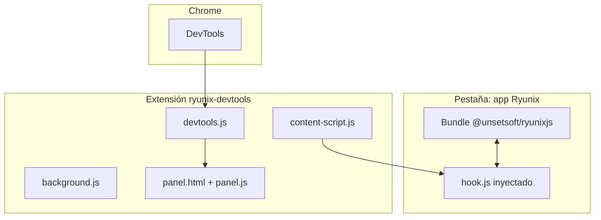

# Ryunix DevTools — resumen del paquete

> **Language / Idioma:** [English](../../en/ryunix-devtools/package-overview.md)
> · [Español](./resumen-del-paquete.md)

El paquete **`@unsetsoft/ryunix-devtools`** vive en `packages/ryunix-devtools/`.
Es una **extensión de navegador** (Chrome / Edge) para depurar aplicaciones
Ryunix: árbol de componentes, props y contadores de hooks. No se publica como
librería npm consumida por apps; se carga en modo _unpacked_ desde el monorepo.

---

## Índice

- [Ryunix DevTools — resumen del paquete](#ryunix-devtools--resumen-del-paquete)
  - [Índice](#índice)
  - [Rol en el monorepo](#rol-en-el-monorepo)
  - [Uso público](#uso-público)
  - [Estructura de `packages/ryunix-devtools/`](#estructura-de-packagesryunix-devtools)
  - [Piezas de la extensión](#piezas-de-la-extensión)
  - [TypeScript y build](#typescript-y-build)
  - [Flujo de alto nivel](#flujo-de-alto-nivel)
  - [Documentación relacionada](#documentación-relacionada)

---

## Rol en el monorepo

| Paquete                      | Responsabilidad                                               |
| :--------------------------- | :------------------------------------------------------------ |
| `@unsetsoft/ryunixjs`        | Expone hooks de depuración en desarrollo (`devtools` en core) |
| `@unsetsoft/ryunix-devtools` | UI en Chrome DevTools que lee ese estado                      |
| `@unsetsoft/ryunix-presets`  | Sirve la app donde corre la extensión                         |
| `@unsetsoft/cra`             | Opcionalmente recomienda la extensión VS Code / workspace     |

La extensión **no** participa en `ryunix build` ni en el bundle de producción de
las apps. Es herramienta de mantenedor y desarrollador.

---

## Uso público

Instalación local (desde el clon del repo):

1. Abrir `chrome://extensions/`
2. Activar **Modo desarrollador**
3. **Cargar descomprimida** → carpeta `packages/ryunix-devtools`
4. Abrir DevTools (F12) en una app Ryunix y usar el panel **Ryunix**

Requisito: app construida con una versión compatible del core (ver README del
paquete, p. ej. Ryunix 1.3+).

---

## Estructura de `packages/ryunix-devtools/`

```text
packages/ryunix-devtools/
├── package.json
├── manifest.json           # Manifest V3; apunta a *.js compilados
├── tsconfig.json
├── tsconfig.emit.json      # Emite .js junto a cada .ts en la raíz del paquete
├── chrome.d.ts             # Stubs mínimos de APIs Chrome (sin @types/chrome)
├── window.d.ts
├── background.ts / background.js       # Service worker
├── content-script.ts / content-script.js
├── devtools.ts / devtools.js           # Puente con Chrome DevTools API
├── devtools.html                       # Página devtools_page del manifest
├── hook.ts / hook.js                   # Inyectado en la página (web_accessible)
├── panel.ts / panel.js
└── panel.html                          # UI del panel Ryunix
```

No hay subcarpeta `src/`: fuentes y salida viven en la **raíz del paquete**. Los
`.js` son emitidos por `tsc` salvo HTML estáticos.

---

## Piezas de la extensión

| Archivo                         | Rol                                                               |
| :------------------------------ | :---------------------------------------------------------------- |
| `manifest.json`                 | Permisos, `content_scripts`, `background`, `devtools_page`        |
| `content-script.js`             | Se ejecuta al inicio del documento en todas las URLs configuradas |
| `hook.js`                       | Recurso accesible desde la página; enlaza con el runtime Ryunix   |
| `background.js`                 | Service worker (MV3)                                              |
| `devtools.js` + `devtools.html` | Crea el panel personalizado en DevTools                           |
| `panel.js` + `panel.html`       | Árbol de componentes, props, contador de hooks                    |

La detección automática de apps Ryunix depende de que el core en desarrollo
exponga la información que el hook consume (ver
[devtools-y-profiler.md](../core/devtools-y-profiler.md) en el core).

---

## TypeScript y build

| Script      | Comando                         |
| :---------- | :------------------------------ |
| `typecheck` | `tsc --noEmit -p tsconfig.json` |
| `build`     | `tsc -p tsconfig.emit.json`     |

Fuentes incluidas en emit: `background.ts`, `content-script.ts`, `devtools.ts`,
`hook.ts`, `panel.ts`.

Tras editar `.ts`:

```bash
pnpm --filter @unsetsoft/ryunix-devtools typecheck
pnpm --filter @unsetsoft/ryunix-devtools build
```

Recargar la extensión en `chrome://extensions/` antes de probar cambios.

---

## Flujo de alto nivel



1. `content-script` corre al cargar la página.
2. `hook.js` se comunica con el runtime Ryunix en la página.
3. El panel DevTools muestra el árbol y metadatos leídos vía ese puente.

---

## Documentación relacionada

| Documento                                                        | Contenido                               |
| :--------------------------------------------------------------- | :-------------------------------------- |
| [core/devtools-y-profiler.md](../core/devtools-y-profiler.md)    | Advertencias y profiler en el motor     |
| [core/resumen-del-paquete.md](../core/resumen-del-paquete.md)    | Paquete `@unsetsoft/ryunixjs`           |
| [App de integración local](../guias/app-de-integracion-local.md) | Probar una app con la extensión cargada |
| `packages/ryunix-devtools/README.md`                             | Instalación y compatibilidad            |
