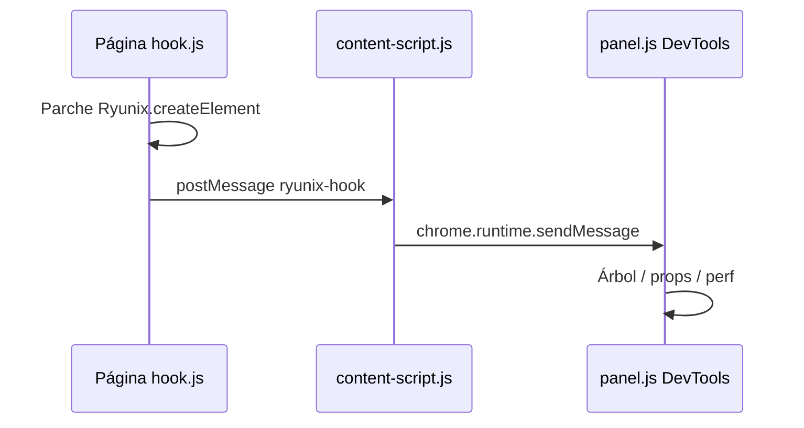

<!-- markdownlint-disable MD013 MD060 -->

# `packages/ryunix-devtools` — extensión Chrome

Extensión **Manifest V3** para Chromium que inspecciona apps Ryunix en ejecución:
lista componentes, props sanitizadas y tiempos de render en un panel de DevTools.
Complementa (no sustituye) las utilidades de desarrollo del core
(`devtools.js`, `profiler.js`).

**No es dependencia npm** de las apps. Se carga sin empaquetar o vía zip de release.

---

## Rol en el monorepo

| Aspecto | Detalle |
| :------ | :------ |
| **Quién lo usa** | Mantenedores y desarrolladores depurando en el navegador |
| **Requisito en la página** | `window.Ryunix` expuesto (bundle cliente del preset) |
| **Publicación** | Excluida de `pnpm publish:all` (distribución de extensión, no npm de apps) |
| **Relación con el core** | Monkey-patch externo; el reconciler no llama APIs oficiales de la extensión |



---

## Estructura del paquete

```text
packages/ryunix-devtools/
├── manifest.json           # MV3, content_scripts, devtools_page
├── background.js           # Service worker (reenvío de mensajes)
├── content-script.js       # Puente ventana ↔ extensión; inyecta hook.js
├── hook.js                 # Contexto de página: parche createElement/init
├── devtools.html / devtools.js   # Registra panel "Ryunix"
├── panel.html / panel.js         # UI Components + Performance
└── README.md
```

| Archivo | Función |
| :------ | :------ |
| **hook.js** | Espera `window.Ryunix`, registra `__RYUNIX_DEVTOOLS_HOOK__`, envía eventos `fiber` / `render` / `ready` vía `postMessage` |
| **content-script.js** | Escucha mensajes de la página y reenvía a `chrome.runtime` |
| **background.js** | Service worker; reenvía a pestaña activa |
| **devtools.js** | `chrome.devtools.panels.create('Ryunix', …, 'panel.html')` |
| **panel.js** | Pestañas Components y Performance; estado desconectado → conectado |

### Conexión con `packages/core`

| Capa en el core | ¿Usada por la extensión? |
| :-------------- | :----------------------- |
| `src/main.js` → `window.Ryunix` | **Sí** — punto de enganche |
| `src/lib/devtools.js` | **No** — avisos de hooks en consola (build dev) |
| `src/lib/profiler.js` | **No** — profiler en memoria del core |

La extensión **no lee fibers del reconciler**; infiere metadata al interceptar
`createElement`. Es un prototipo de inspección, no un bridge oficial del runtime.

---

## Cómo usarla

1. Compilar o clonar el monorepo.
2. Chrome → `chrome://extensions/` → **Modo desarrollador** → **Cargar descomprimida**
   → seleccionar `packages/ryunix-devtools`.
3. Abrir una app Ryunix (`pnpm run dev` en el proyecto).
4. F12 → pestaña **Ryunix** (panel personalizado).

Zip opcional (según README del paquete):

```bash
cd packages/ryunix-devtools && npm run build
```

---

## Limitaciones conocidas (para mantenedores)

| Tema | Detalle |
| :--- | :------ |
| Iconos del panel | `devtools.js` referencia `icons/icon48.png`; puede faltar en el árbol |
| Modelo de datos | Lista plana de “fibers”, no árbol jerárquico del reconciler |
| Highlight | Overlay en página desde `hook.js`; no sincronizado con clics del panel |
| API estable | Sin contrato público entre core y extensión; cambios en `Ryunix.createElement` pueden romper el hook |

Mejoras futuras podrían exponer hooks desde el core; hoy la documentación del
runtime está en [../core/devtools-y-profiler.md](../core/devtools-y-profiler.md).

---

## Relación con otros paquetes

| Paquete | Relación |
| :------ | :------- |
| `core` | Provee `window.Ryunix` y VDOM |
| `ryunix-presets` | Sirve la app donde corre la extensión |
| `ryunix-vscode` | Editor `.ryx`; depuración distinta (navegador vs IDE) |
| `cra` | No instala la extensión |

---

## Documentación relacionada

| Tema | Documento |
| :--- | :-------- |
| Profiler y avisos del core | [../core/devtools-y-profiler.md](../core/devtools-y-profiler.md) |
| Extensión VS Code | [../ryunix-vscode/resumen-paquete.md](../ryunix-vscode/resumen-paquete.md) |

Par en inglés: [docs/en/ryunix-devtools/package-overview.md](../../en/ryunix-devtools/package-overview.md).
