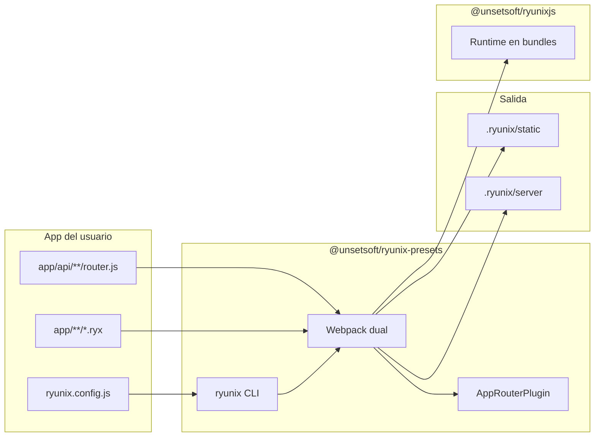

# Ryunix Presets — resumen del paquete

> **Language / Idioma:** [English](../../en/ryunix-presets/package-overview.md)
> · [Español](./resumen-del-paquete.md)

El paquete npm **`@unsetsoft/ryunix-presets`** vive en
`packages/ryunix-presets/`. Es el **tooling de build y CLI** de RyunixJS:
comando `ryunix`, Webpack dual (cliente + servidor), routing por archivos en
`app/`, SSG, APIs y loaders (RSC, Server Actions, MDX). Depende del core como
`peerDependency`.

---

## Índice

- [Ryunix Presets — resumen del paquete](#ryunix-presets--resumen-del-paquete)
  - [Índice](#índice)
  - [Rol en el monorepo](#rol-en-el-monorepo)
  - [Uso público](#uso-público)
  - [Estructura de `packages/ryunix-presets/`](#estructura-de-packagesryunix-presets)
  - [Comandos CLI (`ryunix`)](#comandos-cli-ryunix)
  - [TypeScript y artefactos publicados](#typescript-y-artefactos-publicados)
  - [Flujo de alto nivel](#flujo-de-alto-nivel)
  - [Documentación relacionada](#documentación-relacionada)

---

## Rol en el monorepo

| Paquete                     | Responsabilidad                                       |
| :-------------------------- | :---------------------------------------------------- |
| `@unsetsoft/ryunix-presets` | Dev server, build, start, Webpack, `ryunix.config.js` |
| `@unsetsoft/ryunixjs`       | Runtime importado en los bundles que genera el preset |
| `@unsetsoft/cra`            | Añade el preset en `devDependencies` de apps nuevas   |

Toda la lógica de **enrutamiento compile-time**, **SSG** y **servidor de
desarrollo** vive aquí, no en `packages/core`, salvo APIs que el core exporta
para SSR y Server Actions.

---

## Uso público

En `package.json` de la app:

```json
{
  "scripts": {
    "dev": "ryunix dev",
    "build": "ryunix build",
    "start": "ryunix start"
  },
  "devDependencies": {
    "@unsetsoft/ryunix-presets": "^1.0.x"
  }
}
```

Configuración en la raíz de la app:

```javascript
/** @type {import('@unsetsoft/ryunix-presets').RyunixUserConfig} */
const RyunixSettings = { compiler: 'swc' }
export default RyunixSettings
```

Tipos publicados: `webpack/config.d.ts` (`RyunixUserConfig`).

---

## Estructura de `packages/ryunix-presets/`

```text
packages/ryunix-presets/
├── package.json              # bin: ryunix → webpack/bin/index.js
├── tsconfig.json             # typecheck
├── tsconfig.emit.json        # compila webpack/**/*.ts → .js junto a fuentes
└── webpack/
    ├── bin/
    │   ├── index.ts          # CLI yargs: dev, build, start, lint, customHtml
    │   ├── dev.server.ts     # Servidor de desarrollo
    │   ├── prod.server.ts    # Servidor de producción
    │   ├── compiler.ts       # Invoca Webpack
    │   └── prerender.ts      # SSG tras build
    ├── utils/
    │   ├── config.cjs        # Valores por defecto y carga de ryunix.config
    │   ├── appRouterPlugin.ts
    │   ├── ApiRouterPlugin.ts
    │   ├── ssg.ts / ssgPlugin.ts
    │   └── apiHandler.ts, ssrDevHandler.ts, …
    ├── loaders/
    │   ├── ryunix-rsc-loader.ts
    │   └── ryunix-server-action-loader.ts
    ├── plugins/
    │   └── remark-github-alerts.ts
    ├── webpack.config.ts     # Config dual cliente/servidor
    ├── eslint.config.ts      # ESLint opinado para `ryunix lint`
    ├── config.d.ts           # Tipos para consumidores
    ├── index.ts              # Export del paquete (tipos / utilidades)
    └── template/
        └── index.html        # Plantilla HTML base
```

Lo publicado en npm es la carpeta **`webpack/`** (`files` en `package.json`).
Los `.js` junto a `.ts` bajo `webpack/` incluyen salida de `tsc` además de
fuentes legacy; tras editar `.ts`, ejecutar `build` antes de probar el CLI.

---

## Comandos CLI (`ryunix`)

| Comando             | Función resumida                                           |
| :------------------ | :--------------------------------------------------------- |
| `ryunix dev`        | Modo desarrollo, HMR, handler SSR                          |
| `ryunix build`      | Limpia `.ryunix/`, compila Webpack, opcional prerender SSG |
| `ryunix start`      | Sirve build de producción (`build/static`)                 |
| `ryunix lint`       | ESLint con config del preset                               |
| `ryunix customHtml` | Copia `index.html` base a `public/`                        |

Detalle: [cli-y-arranque.md](./cli-y-arranque.md).

---

## TypeScript y artefactos publicados

| Aspecto           | Detalle                                                                                 |
| :---------------- | :-------------------------------------------------------------------------------------- |
| Fuente mantenedor | `webpack/**/*.ts` (migración de entradas y utilidades en curso/completada según módulo) |
| Comprobación      | `pnpm --filter @unsetsoft/ryunix-presets typecheck`                                     |
| Emit              | `pnpm --filter @unsetsoft/ryunix-presets build`                                         |
| Consumidor        | Solo necesita `.d.ts` + `.js` publicados; no compila el preset                          |

Algunos archivos siguen en `.cjs` (`config.cjs`, `settingfile.cjs`) por
compatibilidad con carga de config en Node.

Más: [TypeScript en el monorepo](../guias/typescript-en-el-monorepo.md).

---

## Flujo de alto nivel



1. `ryunix dev` lee config, descubre rutas bajo `app/` y arranca Webpack +
   servidor.
2. `ryunix build` genera artefactos estáticos y servidor para producción/SSG.
3. El navegador carga chunks que importan `@unsetsoft/ryunixjs`.

---

## Documentación relacionada

| Documento                                                     | Contenido                       |
| :------------------------------------------------------------ | :------------------------------ |
| [cli-y-arranque.md](./cli-y-arranque.md)                      | Servidores dev/prod, comandos   |
| [carga-de-configuracion.md](./carga-de-configuracion.md)      | `ryunix.config.js`              |
| [enrutamiento-y-ssg.md](./enrutamiento-y-ssg.md)              | Router y prerender              |
| [enrutador-api.md](./enrutador-api.md)                        | Rutas API                       |
| [loaders-webpack.md](./loaders-webpack.md)                    | RSC y Server Actions            |
| [core/resumen-del-paquete.md](../core/resumen-del-paquete.md) | Motor empaquetado por el preset |
| `packages/ryunix-presets/README.md`                           | Instalación y flags de usuario  |
