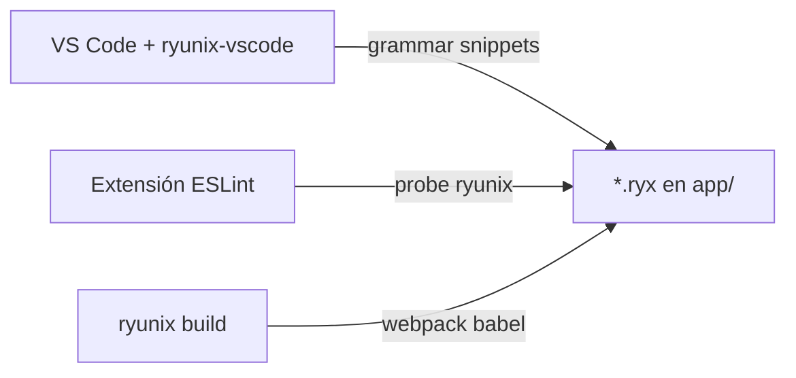

<!-- markdownlint-disable MD013 MD060 -->

# `packages/ryunix-vscode` — extensión VS Code

Código fuente de la extensión de editor **RyunixJS** publicada en Visual Studio
Marketplace como
[`unsetsoft.ryunixjs`](https://marketplace.visualstudio.com/items?itemName=unsetsoft.ryunixjs).
Aporta resaltado de sintaxis, snippets y completions ligeras para archivos
`.ryx` (JavaScript + JSX con convenciones App Router). **No sustituye** al
compilador ni al LSP de TypeScript.

---

## Rol en el monorepo

| Aspecto             | Detalle                                                                   |
| :------------------ | :------------------------------------------------------------------------ |
| **Quién lo usa**    | Desarrolladores que editan `.ryx` en VS Code                              |
| **Runtime de apps** | Las apps usan `@unsetsoft/ryunixjs`; esta extensión solo afecta al editor |
| **Integración CRA** | `--vscode` recomienda Ryunix + ESLint (+ Prettier con `--eslint`)         |
| **Publicación**     | Marketplace / `.vsix`; excluida de `pnpm publish:all` npm                 |



---

## Estructura del paquete

```text
packages/ryunix-vscode/
├── src/                           # TypeScript (fuente)
│   ├── extension.ts               # activate / deactivate
│   ├── types.ts
│   └── completion/
│       ├── provider.ts            # registerCompletionItemProvider
│       ├── imports.ts             # exports @unsetsoft/ryunixjs
│       ├── keywords.ts            # Metatags, frontmatter, generateMetadata
│       └── file-context.ts        # plantillas por layout.ryx, index.ryx, …
├── out/                           # JS compilado (main del manifiesto)
├── language/
│   ├── ryunix.language-configuration.json
│   └── ryx-tags.language-configuration.json
├── syntaxes/
│   └── JavaScriptRyunix.tmLanguage.json   # ~6000 líneas TextMate
├── snippets/
│   └── javascript.code-snippets
├── assets/
│   ├── icon.png
│   └── logo-light.svg / logo-dark.svg
├── test/
│   ├── grammar.test.cjs           # Regresión TextMate
│   └── fixtures/*.ryx
├── .vscode/
│   ├── launch.json                # F5 + preLaunchTask compile
│   └── tasks.json
├── package.json                   # name: "ryunixjs" → ID unsetsoft.ryunixjs
├── ROADMAP.md                     # LSP, semantic tokens (futuro)
└── CHANGELOG.md
```

El campo `"name": "ryunixjs"` es **intencional**: Marketplace ID =
`{publisher}.{name}` → `unsetsoft.ryunixjs`.

---

## Cómo funciona la extensión

### Activación

- Evento `onLanguage:ryunix`.
- Asociación de archivos `*.ryx` (CRA también escribe `files.associations`).

### Qué aporta al editor

| Capa                | Implementación                                                                                                                                                       |
| :------------------ | :------------------------------------------------------------------------------------------------------------------------------------------------------------------- |
| **Sintaxis**        | Gramática TextMate `source.js.ryx` + lenguaje embebido `ryx-tags` para JSX                                                                                           |
| **Snippets**        | `snippets/javascript.code-snippets` (`ryx-page`, `ryx-layout`, …)                                                                                                    |
| **Completions**     | `src/completion/provider.ts`: imports del core, keywords, sugerencias por nombre de archivo                                                                          |
| **Ir a definición** | Ctrl+clic en `useStore`, `Link`, … → `node_modules/@unsetsoft/ryunixjs` o `packages/core` (`src/navigation/`)                                                        |
| **Hover**           | Tooltip en exports Ryunix, etiquetas HTML (`<main>`) y clases en `className`                                                                                         |
| **Tailwind**        | Defaults para [Tailwind CSS IntelliSense](https://marketplace.visualstudio.com/items?itemName=bradlc.vscode-tailwindcss); con `--tailwind` CRA también la recomienda |

### Language Server (LSP) — v1.1.0+

Con `"ryunix.languageServer.enable": true` (por defecto) se inicia un **servidor de lenguaje**
que usa el compilador **TypeScript** sobre tus `.ryx` (como TSX con `Ryunix.createElement`):

| Capacidad LSP          | Atajo / uso                            |
| :--------------------- | :------------------------------------- |
| Ir a definición        | Ctrl+clic en símbolos, imports, tipos  |
| Buscar referencias     | Panel / comando References             |
| Hover con tipos        | Pasar el mouse                         |
| Diagnósticos           | Subrayados de error/aviso en el editor |
| Renombrar símbolo      | F2                                     |
| Símbolos del documento | Outline / breadcrumbs                  |
| Autocompletado         | Ctrl+Espacio (semántico TS)            |
| Ayuda de firma         | Al escribir `(` en llamadas            |

Requisitos en el proyecto: `pnpm install` y `jsconfig.json` (las plantillas CRA ya lo incluyen).

Desactivar LSP y volver al modo ligero: `"ryunix.languageServer.enable": false` (usa
`ryunix.enableNavigation` para hovers simples).

### Completions contextuales

Si el archivo se llama `layout.ryx`, `loading.ryx`, `index.ryx`, etc., se
priorizan plantillas acordes (misma lógica que snippets). Dentro de
`import { … }` se listan hooks (`useStore`, `Link`, …).

Alias documentado: `frontmatter` como alternativa a `Metatags` (el router del
preset también lo contempla en build).

---

## Alcance explícito

| Soportado                               | No soportado (usar otra herramienta)             |
| :-------------------------------------- | :----------------------------------------------- |
| Resaltado `.ryx`, snippets, completions | **MDX** — validación en build (`@mdx-js/loader`) |
| Integración ESLint vía workspace (CRA)  | **TypeScript** dentro de `.ryx`                  |
| Emmet en modo `ryunix`                  | **Formatter empaquetado** — Prettier en proyecto |
| Tests de regresión de gramática         | **LSP** — ver `ROADMAP.md`                       |

Rutas API en plantillas CRA: `router.js`; snippets para `router.ryx` son
opcionales.

---

## Comandos

```bash
pnpm --filter ./packages/ryunix-vscode run compile
pnpm --filter ./packages/ryunix-vscode run watch
pnpm --filter ./packages/ryunix-vscode run test
pnpm --filter ./packages/ryunix-vscode run build    # compile + .vsix
```

Instalación local:

```bash
code --install-extension packages/ryunix-vscode/ryunixjs-1.0.4.vsix
```

Publicación Marketplace (mantenedores):

```bash
pnpm --filter ./packages/ryunix-vscode run publish:marketplace
```

### Desarrollo con F5

1. Abrir la carpeta `packages/ryunix-vscode` en VS Code.
2. **Run and Debug** → **Extension** → F5 (compila antes con `preLaunchTask`).
3. En la ventana Extension Development Host, abrir una app (p. ej. plantilla
   `ryunix-base` o `test/webpack`).

Tras cambiar `src/` o gramática: recompilar o recargar la ventana del host.

---

## Relación con otros paquetes

| Paquete           | Relación                                               |
| :---------------- | :----------------------------------------------------- |
| `core`            | Lista de exports para completions                      |
| `cra`             | `--vscode` escribe settings y extensiones recomendadas |
| `ryunix-presets`  | ESLint `ryunix` language; convenciones `app/*.ryx`     |
| `ryunix-devtools` | Depuración en navegador, independiente del editor      |

---

## Documentación relacionada

| Tema                   | Documento                                                                          |
| :--------------------- | :--------------------------------------------------------------------------------- |
| Flag `--vscode` en CRA | [../cra/cli-y-ayudantes.md](../cra/cli-y-ayudantes.md)                             |
| Convenciones `app/`    | [../ryunix-presets/enrutamiento-y-ssg.md](../ryunix-presets/enrutamiento-y-ssg.md) |
| Roadmap LSP            | `packages/ryunix-vscode/ROADMAP.md`                                                |

Par en inglés: [docs/en/ryunix-vscode/package-overview.md](../../en/ryunix-vscode/package-overview.md).

README del paquete: `packages/ryunix-vscode/README.es.md`.
